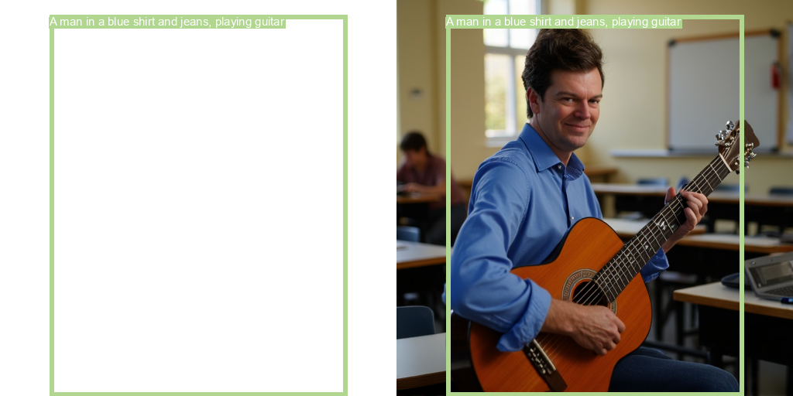
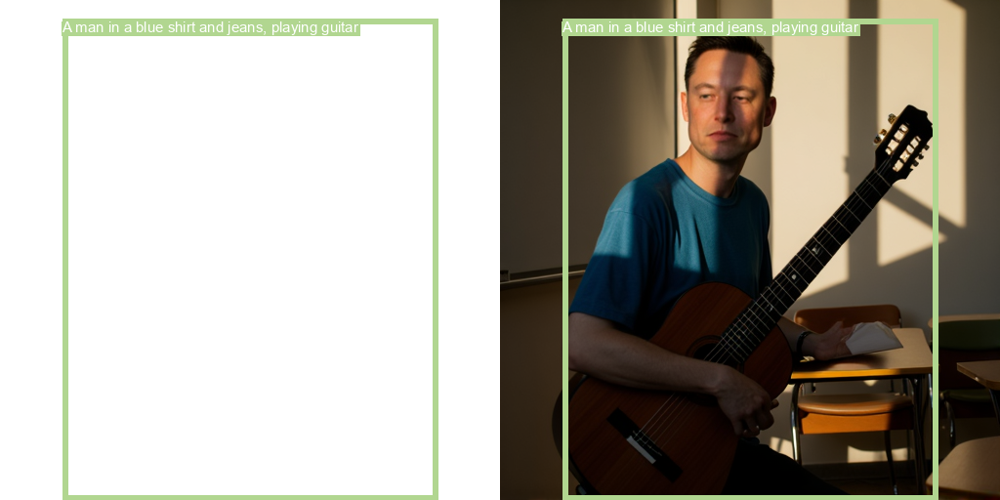
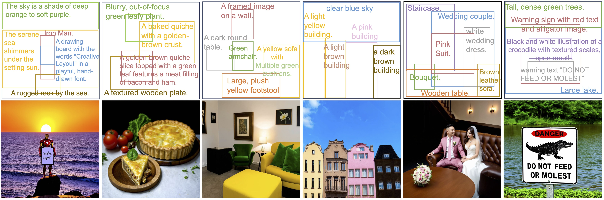
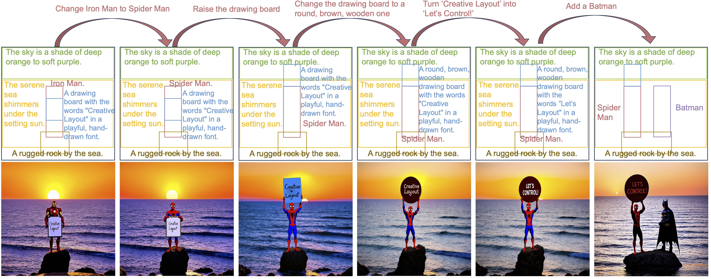
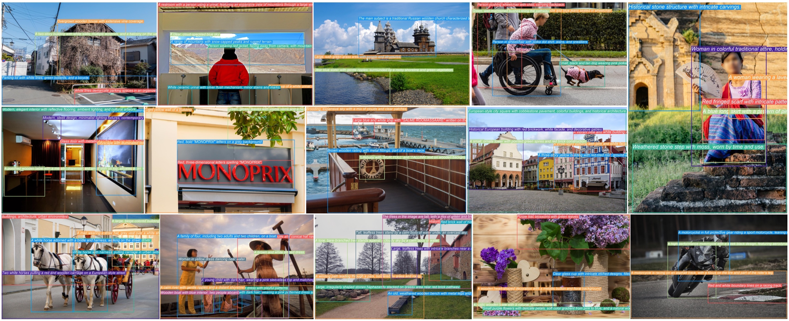

# CreatiLayout-PuLID




<br>
<a href="https://arxiv.org/pdf/2412.03859"></a>
<a href="https://creatilayout.github.io/"></a>
<a href="https://huggingface.co/datasets/HuiZhang0812/LayoutSAM"></a>
<a href="https://huggingface.co/datasets/HuiZhang0812/LayoutSAM-eval"></a>
<a href="https://huggingface.co/HuiZhang0812/CreatiLayout"></a>
<a href="https://huggingface.co/spaces/HuiZhang0812/CreatiLayout"></a>


> **CreatiLayout: Siamese Multimodal Diffusion Transformer for Creative Layout-to-Image Generation**
> <br>
> [Hui Zhang](https://huizhang0812.github.io/), 
> [Dexiang Hong](https://scholar.google.com.hk/citations?user=DUNijlcAAAAJ&hl=zh-CN), 
> Tingwei Gao, 
> [Yitong Wang](https://scholar.google.com/citations?user=NfFTKfYAAAAJ&hl=zh-CN),
> Jie Shao,
> [Xinglong Wu](https://scholar.google.com/citations?user=LVsp9RQAAAAJ&hl=zh-CN),
> [Zuxuan Wu](https://zxwu.azurewebsites.net/),
> and 
> [Yu-Gang Jiang](https://scholar.google.com/citations?user=f3_FP8AAAAAJ)
> <br>
> Fudan University & ByteDance Inc.
> <br>

## Introduction
CreatiLayout is a layout-to-image framework for Diffusion Transformer models, offering high-quality and fine-grained controllable generation.

**LayoutSAM Dataset** 📚: A large-scale layout dataset with 2.7 million image-text pairs and 10.7 million entities, featuring fine-grained annotations for open-set entities.

**SiamLayout** 🌟: A novel layout integration network for MM-DiT treats the layout as an independent modality with its own set of transformer parameters, allowing the layout to play an equally important role as the global description in guiding the image.

**Layout Designer** 🎨: A layout planner leveraging the power of large language models to convert various user inputs (e.g., center points, masks, scribbles) into standardized layouts. 

## 🔥 News
- **2025-3-28**: forked from HuiZhang0812/CreatiLayout and Add pulid functionality to it
- **2025-3-10**: We release **CreatiLayout-FLUX**, which empowers FLUX.1-dev for layout-to-image generation and achieves more precise rendering of spatial relationships and attributes.
- **2025-1-30**: We propose **CreatiLayout-LoRA**, which achieves layout control with fewer additional parameters.


## Quick Start
### Setup
1. **Environment setup**
```bash
conda create -n creatilayout python=3.10 -y
conda activate creatilayout
conda install pytorch==2.4.1 torchvision==0.19.1 torchaudio==2.4.1 pytorch-cuda=12.1 -c pytorch -c nvidia
```
2. **Requirements installation**
```bash
pip install -r requirements.txt
```
### Usage example
You can run the following code to generate an image:
```python
python test_sample.py
```
Or you can try gradio at <a href="https://huggingface.co/spaces/HuiZhang0812/CreatiLayout"></a>.
<div align="center">
  
</div>


## Dataset
### LayoutSAM <a href="https://huggingface.co/datasets/HuiZhang0812/LayoutSAM"></a>
The LayoutSAM dataset is a large-scale layout dataset derived from the SAM dataset, containing 2.7 million image-text pairs and 10.7 million entities. Each entity is annotated with a spatial position (i.e., bounding box) and a textual description. Traditional layout datasets often exhibit a closed-set and coarse-grained nature, which may limit the model's ability to generate complex attributes such as color, shape, and texture.
<div align="center">
  
</div>

### LayoutSAM-eval Benchmark <a href="https://huggingface.co/datasets/HuiZhang0812/LayoutSAM-eval"></a>
LayoutSAM-Eval is a comprehensive benchmark for evaluating the quality of Layout-to-Image (L2I) generation models. This benchmark assesses L2I generation quality from two perspectives: region-wise quality (spatial and attribute accuracy) and global-wise quality (visual quality and prompt following). It employs the VLM’s visual question answering to evaluate spatial and attribute adherence, and utilizes various metrics including IR score, Pick score, CLIP score, FID, and IS to evaluate global image quality.

To evaluate the model's layout-to-image generation capabilities through LayoutSAM-Eval, first you need to generate images for each data in the benchmark by running the following code:
```python
python test_SiamLayout_sd3_layoutsam_benchmark.py
```
Then, visual language models (VLM) are used to answer visual questions. This will assess each image's adherence to spatial and attribute specifications. You can do this by using the following code:
```python
python score_layoutsam_benchmark.py
```


## Models
**Layout-to-Image generation:**
| Model   | Base model    |  Description  |
| ------------------------------------------------------------------------------------------------ | -------------- | -------------------------------------------------------------------------------------------------------- |
| <a href="https://huggingface.co/HuiZhang0812/CreatiLayout"></a> | Stable Diffusion 3 | SiamLayout-SD3 used in the paper
| <a href="https://huggingface.co/HuiZhang0812/CreatiLayout"></a> | Stable Diffusion 3 | SiamLayout-SD3-LoRA used in the paper
| <a href="https://huggingface.co/HuiZhang0812/CreatiLayout"></a> | FLUX.1-dev | SiamLayout-FLUX used in the paper

## ✒️ Citation

If you find our work useful for your research and applications, please kindly cite using this BibTeX:

```latex
@article{zhang2024creatilayout,
  title={CreatiLayout: Siamese Multimodal Diffusion Transformer for Creative Layout-to-Image Generation},
  author={Zhang, Hui and Hong, Dexiang and Gao, Tingwei and Wang, Yitong and Shao, Jie and Wu, Xinglong and Wu, Zuxuan and Jiang, Yu-Gang},
  journal={arXiv preprint arXiv:2412.03859},
  year={2024}
}
```
